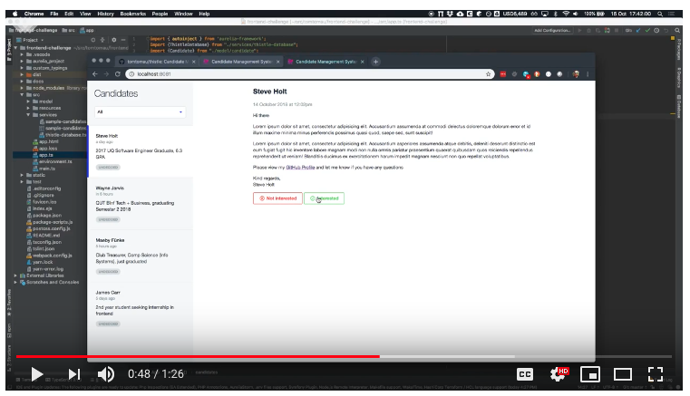

# Aurelia Frontend Challenge

## Task:

Implement a "Candidate Management System" in Aurelia + TypeScript.

As a user, I want to:

* see a list of candidates
* click on a candidate to preview the message
* mark a candidate as "not interested" / "interested"
* filter candidates by decision (undecided/not interested/interested) 

## Designs

TODO: Insert designs

## Demo:

[](http://www.youtube.com/watch?v=maH0W3cLgko)

## Background:

We use the [Aurelia JavaScript framework](https://aurelia.io/) at Hyra iQ - we like it because it leverages next gen
web/browser features, leverages convention over configuration and let's us write code that is more focused on the business
logic, rather than the framework.

## Running the application

### Prerequisites:

These are global installations required for the project:

* node
* yarn package manager - [install](https://yarnpkg.com/en/docs/install)
* Aurelia CLI - [docs & install](https://aurelia.io/docs/build-systems/aurelia-cli/)

### Setting up the application

Install dependencies using yarn. Yarn is very similar to npm, we like yarn as it's quite quick ⚡️

```bash
$ yarn install
```

## Read more:

* [Running the application](docs/running-the-application.md)
* [Guide: Writing styles](docs/guide-styles.md)
* [Guide: Fonts/Icons](docs/guide-fonts-icons.md)
* [Helpful Resources](docs/helpful-resources.md)
