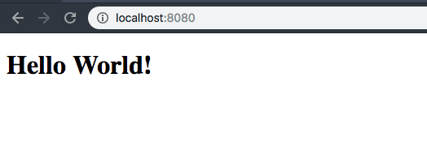
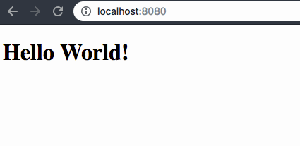

### Running the application

Use the Aurelia CLI to run the application:

```bash
$ au run
```

This will run a local server at `http://localhost:8080` (unless you have another process bound to that port).

Otherwise, you should be able to navigate to this address in your browser of choice:



This project has Live Reload set up, so when you save a file change, it will trigger a reload in your browser:


